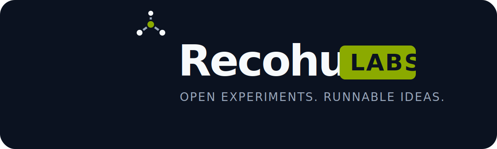

  

## Build what is next

Recohut Labs is the open-source experimentation arm of [Recohut](https://www.recohut.com). We turn research and emerging ideas into runnable, inspectable software for applied AI and data systems.

Repositories here are built to help engineers learn quickly, test assumptions, and carry useful patterns into real systems. Every project should state what works, what remains experimental, and how to reproduce its evidence.

### What lives here

- **Experiments** — narrow implementations that test one meaningful technical idea.
- **Reference implementations** — documented examples designed to be understood and adapted.
- **Incubating projects** — actively developed tools with a path toward broader use.

### How we work

- Runnable beats theoretical.
- Evidence beats confident claims.
- Clear boundaries beat hidden complexity.
- Useful experiments may fail; undocumented ones teach nothing.

Start with a repository README, check its maturity label, and follow its local setup and contribution guide.

---

Recohut Labs projects are experimental unless a repository explicitly states otherwise.
